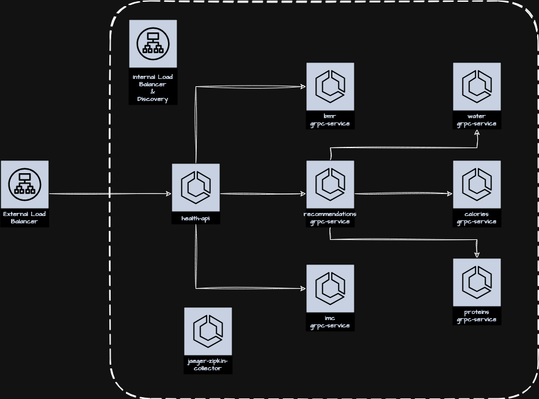
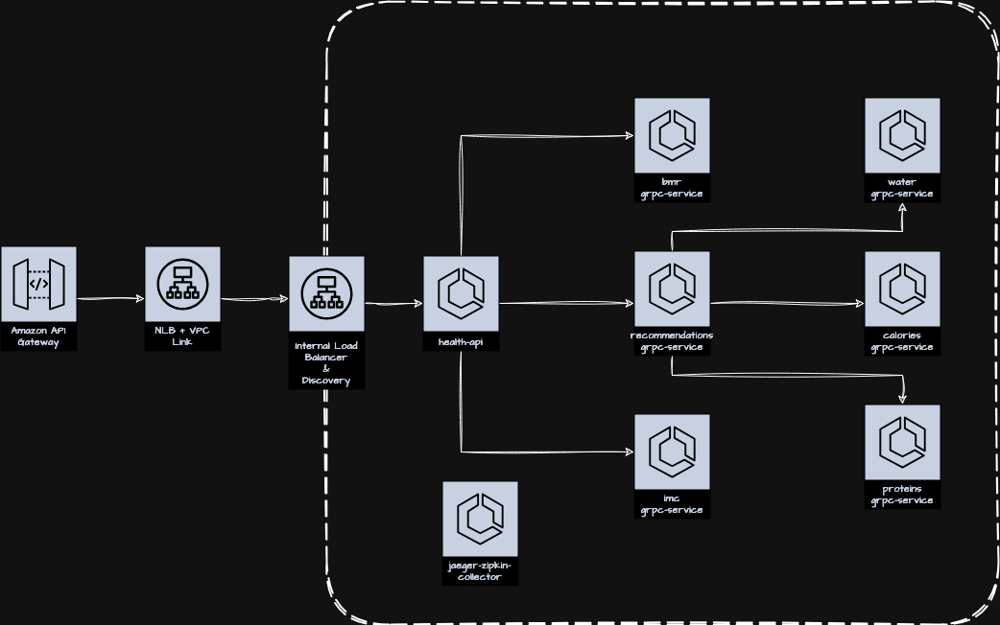

# Lab do Health API
Repositório usado para subir o lab de microserviços do Health API no ECS usando o modulo criado em aula

## [v1] - Roteamento Interno e Externo

O Objetivo é subir um ambiente com comunicação distribuída entre vários microserviços internos e externos dentro da AWS 



```bash
curl --location --request POST 'https://health.jjasonhenrique.com/v1/calculator' \
--header 'Content-Type: application/json' \
--header 'x-api-key: K9x6PDgaQM3DF52sWiV8Q6Er8g8iSyAtaXRxpSGH' \
--data-raw '{ 
   "age": 38,
   "weight": 81.0,
   "height": 1.75,
   "gender": "M", 
   "activity_intensity": "very_active"
} ' --silent | jq .

```

## [V2] - API Gateway e VPC Link para Exposição Externa

